<picture><source media="(max-width: 600px)" srcset="assets/hero-m.svg"></picture>

<picture><source media="(max-width: 600px)" srcset="assets/numbers-m.svg"></picture>

## [Причал](https://prichal.tech) — моя PaaS

<a href="https://prichal.tech"><picture><source media="(max-width: 600px)" srcset="assets/flow-m.svg"></picture></a>

- **Чужой код — в песочнице.** Каждый контейнер пользователя работает в gVisor, а не на ядре ноды.
- **Сеть закрыта по умолчанию.** Проекты разных пользователей не видят друг друга.
- **Сборка без root.** Образы собирает rootless BuildKit, теги неизменяемые — любой деплой воспроизводим.

**→ [prichal.tech](https://prichal.tech)** — можно зарегистрироваться и задеплоить свой проект.

<b>Как это устроено внутри</b> — для тех, кто любит детали

 

**Пользовательский код исполняется в песочнице, а не на ядре ноды.**
Threat model — недоверенный код: пользователь не имеет доступа к манифестам и к
работающим контейнерам. Все нагрузки тенантов идут через **gVisor (`runsc`)**;
это не опция, а граница безопасности. PodSecurity — `baseline`, потому что при
gVisor-границе `restricted` ломает половину пользовательских образов, ничего
не добавляя к изоляции; capabilities сбрасываются точечно.

**Сеть — default-deny.**
Cilium, egress-контроль, сетевые политики между тенантами. Приёмка кластера
построена на **негативных проверках**: чеклист подтверждает не «оно работает»,
а «чужой код НЕ может выйти за границу» — и прогоняется после каждого изменения
CNI, gVisor или политик.

**Сборка образов без Docker-демона и без привилегий.**
Rootless BuildKit внутри gVisor, в отдельном неймспейсе с ResourceQuota.
Собранные образы уезжают в приватный registry неизменяемыми тегами — деплой
всегда воспроизводим, «тот же тег с другим содержимым» невозможен.

**Обновления платформы не ломают прод.**
Миграции БД — отдельный gated Job под advisory lock, а не гонка в entrypoint
нескольких реплик. Стратегия Recreate, неизменяемые теги образов, один скрипт
обновления.

**Ёмкость считается до планирования, а не после отказа.**
Preflight понодно и статус `pending_capacity` вместо ложного `failed`: когда
в кластере нет места, пользователь видит правду, а не «деплой сломался».

**Топология:** 4 ноды в VPC, один публичный IPv4 на NAT-шлюзе, отдельная нода под
БД с local NVMe и тейнтом, Longhorn под тома, CloudNativePG — Postgres на пользователя.
k3s с ручным hardening до дефолтов RKE2; миграция на RKE2 — по мере роста.

**Масштаб:** 75 REST-эндпоинтов, ~18 800 строк Python, 180 тестов на pytest,
6 асинхронных воркеров поверх Redis-очереди с FIFO-гарантией.
Python / FastAPI · React 19 / TypeScript · Kubernetes.

> Код закрыт — платформа коммерческая. Готов провести по архитектуре и показать
> живой деплой на созвоне.

## Коммерческий опыт

**Сейчас · AI-инженерная система** · коммерческий проект

Строю управляемую систему разработки: ИИ-агенты пишут код, тестируют и делают технический анализ,
а я ставлю им задачи, координирую и отвечаю за то, чтобы продукт в итоге реально работал.

**Backend-разработчик (контракт)** · e-commerce · NDA · *окт 2025 — мар 2026*

Посты поставщиков из Telegram → обогащение через LLM → готовые карточки в магазинах.
Тысячи позиций за пару часов вместо ручной работы менеджера.

<b>Что именно я сделал</b>

 

Спроектировал и в одиночку реализовал распределённое ядро из **9 сервисов на RabbitMQ**:
бот на aiogram, FastAPI и 6 асинхронных воркеров, оркестратор двухуровневых workflow
с политиками ошибок на каждом этапе. 22 модели SQLAlchemy, 65 миграций, 33 эндпоинта.
Выгрузка в InSales и WooCommerce.

Чинил корневые причины, а не симптомы:

- падавшие фоновые задачи — PgBouncer'ом и разделением async/sync-подключений, а не ретраями;
- зависшие консьюмеры RabbitMQ — разбором логики `ack`;
- гонки за общий файл сессии Telethon — распределённым локом на Redis.

`Python 3.13` `FastAPI` `RabbitMQ / aio-pika` `PostgreSQL + PgBouncer` `Redis`
`OpenAI API` `Prometheus / Loki` `Docker Compose (17 сервисов)`

## Другие проекты

**Платформы и инфраструктура**

- **[deploy-platform-showcase](https://github.com/0xRaiseX/deploy-platform-showcase)** — открытый срез кода Причала: как устроены сборка, деплой и логи.
- **[global-rate-limiter](https://github.com/0xRaiseX/global-rate-limiter)** — ограничение запросов для всего трафика: Envoy, gRPC, Redis, аналитика в ClickHouse.
- **[super-octo-bassoon](https://github.com/0xRaiseX/super-octo-bassoon)** — первый прототип платформы: деплой Docker-образов в Kubernetes одной кнопкой.
- **[prichal-sample](https://github.com/0xRaiseX/prichal-sample)** — пример приложения: нажал «Deploy» — через минуту оно в сети.
- **[simple-app](https://github.com/0xRaiseX/simple-app)** — REST API с Docker, CI и развёртыванием через Ansible.

**Бэкенд**

- **[tender-tracker](https://github.com/0xRaiseX/tender-tracker)** — учёт тендеров с журналом статусов, который нельзя подделать.
- **[album-catalog](https://github.com/0xRaiseX/album-catalog)** — каталог музыки на Django: исполнители, альбомы, треклисты.
- **[ecdsa](https://github.com/0xRaiseX/ecdsa)** — цифровые подписи на кривой secp256k1 на Rust.

**Сайты**

- **[avtokran-pskov](https://github.com/0xRaiseX/avtokran-pskov)** — лендинг услуги аренды автокрана.

<b>Ранние проекты</b> — с них всё началось

 

- **[oxi-core](https://github.com/0xRaiseX/oxi-core)** — ядро автоторговли на криптобирже: данные по WebSocket, ордера в реальном времени.
- **[api-manager-exchanges](https://github.com/0xRaiseX/api-manager-exchanges)** — арбитраж ставок финансирования между криптобиржами.
- **[discord-economy-bot](https://github.com/0xRaiseX/discord-economy-bot)** — Discord-бот с экономикой и магазином ролей.

## Стек

`Python` `FastAPI` `async SQLAlchemy` `Django` `Rust` · `AI-агенты` `LLM` · `Kubernetes` `Cilium` `gVisor` `BuildKit`
`Longhorn` `CloudNativePG` · `PostgreSQL` `Redis` `RabbitMQ` `ClickHouse` · `Linux` `GitHub Actions`

 

<a href="https://t.me/raise0x"><picture><source media="(max-width: 600px)" srcset="assets/contact-m.svg"></picture></a>

18 лет · ищу команду, где инфраструктура — часть продукта · maks.demkin87@gmail.com

