<picture><source media="(max-width: 600px)" srcset="assets/hero-m.svg"></picture>

<picture><source media="(max-width: 600px)" srcset="assets/numbers-m.svg"></picture>

<a href="https://prichal.tech"><picture><source media="(max-width: 600px)" srcset="assets/flow-m.svg"></picture></a>

<a href="https://prichal.tech"><picture><source media="(max-width: 600px)" srcset="assets/facts-m.svg"></picture></a>

<b>Как это устроено внутри</b> — для тех, кто любит детали

 

**Пользовательский код исполняется в песочнице, а не на ядре ноды.**
Threat model — недоверенный код: пользователь не имеет доступа к манифестам и к
работающим контейнерам. Все нагрузки тенантов идут через **gVisor (`runsc`)**;
это не опция, а граница безопасности. PodSecurity — `baseline`, потому что при
gVisor-границе `restricted` ломает половину пользовательских образов, ничего
не добавляя к изоляции; capabilities сбрасываются точечно.

**Сеть — default-deny.**
Cilium, egress-контроль, сетевые политики между тенантами. Приёмка кластера
построена на **негативных проверках**: чеклист подтверждает не «оно работает»,
а «чужой код НЕ может выйти за границу» — и прогоняется после каждого изменения
CNI, gVisor или политик.

**Сборка образов без Docker-демона и без привилегий.**
Rootless BuildKit внутри gVisor, в отдельном неймспейсе с ResourceQuota.
Собранные образы уезжают в приватный registry неизменяемыми тегами — деплой
всегда воспроизводим, «тот же тег с другим содержимым» невозможен.

**Обновления платформы не ломают прод.**
Миграции БД — отдельный gated Job под advisory lock, а не гонка в entrypoint
нескольких реплик. Стратегия Recreate, неизменяемые теги образов, один скрипт
обновления.

**Ёмкость считается до планирования, а не после отказа.**
Preflight понодно и статус `pending_capacity` вместо ложного `failed`: когда
в кластере нет места, пользователь видит правду, а не «деплой сломался».

**Топология:** 4 ноды в VPC, один публичный IPv4 на NAT-шлюзе, отдельная нода под
БД с local NVMe и тейнтом, Longhorn под тома, CloudNativePG — Postgres на пользователя.
k3s с ручным hardening до дефолтов RKE2; миграция на RKE2 — по мере роста.

**Масштаб:** ~150 REST-эндпоинтов, ~39 000 строк Python, ~1 950 тестов на pytest и ~470 на фронтенде,
6 асинхронных воркеров поверх Redis-очереди с FIFO-гарантией.
Python / FastAPI · React 19 / TypeScript · Kubernetes.

> Код закрыт — платформа коммерческая. Готов провести по архитектуре и показать
> живой деплой на созвоне.

<picture><source media="(max-width: 600px)" srcset="assets/experience-m.svg"></picture>

<b>Что именно я сделал</b>

 

Спроектировал и в одиночку реализовал распределённое ядро из **9 микросервисов**, связанных очередями RabbitMQ:
бот на aiogram, FastAPI и 6 асинхронных воркеров, оркестратор двухуровневых workflow
с политиками ошибок на каждом этапе. 22 модели SQLAlchemy, 65 миграций, 33 эндпоинта.
Выгрузка в InSales и WooCommerce.

Чинил корневые причины, а не симптомы:

- падавшие фоновые задачи — PgBouncer'ом и разделением async/sync-подключений, а не ретраями;
- зависшие консьюмеры RabbitMQ — разбором логики `ack`;
- гонки за общий файл сессии Telethon — распределённым локом на Redis.

`Python 3.13` `FastAPI` `RabbitMQ / aio-pika` `PostgreSQL + PgBouncer` `Redis`
`OpenAI API` `Prometheus / Loki` `Docker Compose (17 сервисов)`

<picture><source media="(max-width: 600px)" srcset="assets/projects-m.svg"></picture>

<a href="https://github.com/0xRaiseX/deploy-platform-showcase"><picture><source media="(max-width: 600px)" srcset="assets/p-deploy-platform-showcase-m.svg"></picture></a>

<a href="https://github.com/0xRaiseX/global-rate-limiter"><picture><source media="(max-width: 600px)" srcset="assets/p-global-rate-limiter-m.svg"></picture></a>

<a href="https://github.com/0xRaiseX/super-octo-bassoon"><picture><source media="(max-width: 600px)" srcset="assets/p-super-octo-bassoon-m.svg"></picture></a>

<a href="https://github.com/0xRaiseX/tender-tracker"><picture><source media="(max-width: 600px)" srcset="assets/p-tender-tracker-m.svg"></picture></a>

<a href="https://github.com/0xRaiseX/album-catalog"><picture><source media="(max-width: 600px)" srcset="assets/p-album-catalog-m.svg"></picture></a>

<a href="https://github.com/0xRaiseX/prichal-sample"><picture><source media="(max-width: 600px)" srcset="assets/p-prichal-sample-m.svg"></picture></a>

<a href="https://github.com/0xRaiseX/simple-app"><picture><source media="(max-width: 600px)" srcset="assets/p-simple-app-m.svg"></picture></a>

<a href="https://github.com/0xRaiseX/ecdsa"><picture><source media="(max-width: 600px)" srcset="assets/p-ecdsa-m.svg"></picture></a>

<a href="https://github.com/0xRaiseX/avtokran-pskov"><picture><source media="(max-width: 600px)" srcset="assets/p-avtokran-pskov-m.svg"></picture></a>

<b>Ранние проекты</b> — с них всё началось

 

- **[oxi-core](https://github.com/0xRaiseX/oxi-core)** — ядро автоторговли на криптобирже: данные по WebSocket, ордера в реальном времени.
- **[api-manager-exchanges](https://github.com/0xRaiseX/api-manager-exchanges)** — арбитраж ставок финансирования между криптобиржами.
- **[discord-economy-bot](https://github.com/0xRaiseX/discord-economy-bot)** — Discord-бот с экономикой и магазином ролей.

<picture><source media="(max-width: 600px)" srcset="assets/stack-m.svg"></picture>

<a href="https://t.me/raise0x"><picture><source media="(max-width: 600px)" srcset="assets/contact-m.svg"></picture></a>

<a href="https://prichal.tech">prichal.tech</a> · <a href="https://t.me/raise0x">t.me/raise0x</a> · maks.demkin87@gmail.com

