  

  
  
  
  

 

  

**[Prichal](https://prichal.tech)** — PaaS для деплоя из GitHub в один клик, уже работает: **[prichal.tech](https://prichal.tech)**. Один разработчик, ~6 месяцев: бэкенд, фронт, инфраструктура, эксплуатация кластера.

<b>Как это устроено внутри →</b>

 

**Пользовательский код исполняется в песочнице, а не на ядре ноды.**
Threat model — недоверенный код: у пользователя нет доступа к манифестам и к работающим
контейнерам. Все нагрузки тенантов идут через **gVisor (`runsc`)** — это граница безопасности,
а не опция. PodSecurity — `baseline`: при gVisor-границе `restricted` ломает половину
пользовательских образов, ничего не добавляя к изоляции; capabilities сбрасываются точечно.

**Сеть — default-deny.**
Cilium, egress-контроль, сетевые политики между тенантами. Приёмка кластера построена на
**негативных проверках**: чеклист подтверждает не «оно работает», а «чужой код НЕ может
выйти за границу» — и прогоняется после каждого изменения CNI, gVisor или политик.

**Сборка образов без Docker-демона и без привилегий.**
Rootless BuildKit внутри gVisor, в отдельном неймспейсе с ResourceQuota.
Образы уезжают в приватный registry неизменяемыми тегами — деплой всегда воспроизводим.

**Обновления платформы не ломают прод.**
Миграции БД — отдельный gated Job под advisory lock, а не гонка в entrypoint нескольких
реплик. Стратегия Recreate, неизменяемые теги, один скрипт обновления.

**Ёмкость считается до планирования, а не после отказа.**
Preflight понодно и статус `pending_capacity` вместо ложного `failed`.

**Топология:** 4 ноды в VPC, один публичный IPv4 на NAT-шлюзе, отдельная нода под БД с
local NVMe и тейнтом, Longhorn под тома, CloudNativePG — Postgres на пользователя.
k3s с ручным hardening до дефолтов RKE2.

**В цифрах:** 75 REST-эндпоинтов · ~18 800 строк Python · 180 тестов на pytest ·
6 асинхронных воркеров поверх Redis-очереди с FIFO и честным распределением конкурентности.
Python / FastAPI · React 19 / TypeScript · Kubernetes.

> Код закрыт — платформа коммерческая. Готов провести по архитектуре и показать живой деплой на созвоне.

 

  

**AI-инженерия — моя текущая коммерческая работа.** Строю управляемую AI-инженерную систему: ИИ-агенты
программируют, тестируют и проводят технический анализ, а я ставлю им задачи, координирую их и отвечаю
за то, чтобы конечный продукт реально работал.

 

  

**Контракт, NDA.** Один спроектировал и написал распределённую систему, которая заменила ручной труд менеджера.

<b>Подробнее о проекте →</b>

 

Система забирает товарные посты из Telegram-каналов поставщиков, обогащает данные через LLM
и выгружает готовые карточки в магазины на InSales и WooCommerce.

Ядро — **9 сервисов на RabbitMQ**: бот на aiogram, FastAPI и 6 асинхронных воркеров,
оркестратор двухуровневых workflow с политиками ошибок на каждом этапе.
22 модели SQLAlchemy, 65 миграций, 33 эндпоинта.

Чем горжусь больше кода — чинил корневые причины:
- падавшие фоновые задачи — не ретраями, а PgBouncer'ом и разделением async/sync-подключений;
- зависшие консьюмеры RabbitMQ — разбором логики `ack`;
- гонки за общий файл сессии Telethon — распределённым локом на Redis.

`Python 3.13` `FastAPI` `RabbitMQ / aio-pika` `PostgreSQL + PgBouncer` `Redis`
`OpenAI API` `Prometheus / Loki` `Docker Compose (17 сервисов)`

---

### Ещё

- **[global-rate-limiter](https://github.com/0xraisex/global-rate-limiter)** — распределённый rate limiting: Envoy + gRPC token bucket на Redis, логи в ClickHouse, детектор аномалий.
- **[ecdsa](https://github.com/0xraisex/ecdsa)** — ECDSA secp256k1 на Rust, с нуля.

### Стек

`Python` `FastAPI` `async SQLAlchemy` `Rust` · `Kubernetes` `Cilium` `gVisor`
`Longhorn` `CloudNativePG` `BuildKit` · `PostgreSQL` `Redis` `RabbitMQ` `ClickHouse` ·
`Linux` `nftables` `cloud-init` `GitHub Actions`

---

<i>18 лет. Ищу команду, где инфраструктура — не накладные расходы, а часть продукта.</i>

